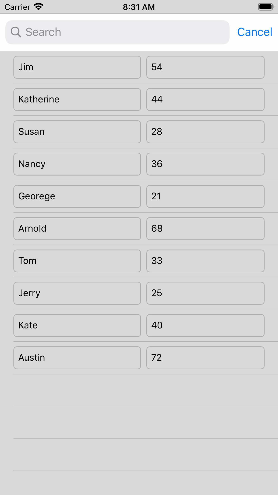

# TextFieldCrazy
The purposes of this Xcode project are

1. to show how a UITextField delegate method can be used through UITableView's cellForRowAt delegate method
2. to show that the UISearchController can be used without the navigation controller.

